<!-- _class: lead -->

## Como criar seu TCC com o VixeText: Automatizando trabalhos acadêmicos com Markdown

**AUTORES**: Reinan Gabriel Dos Santos Souza

<!-- _footer: '13 de agosto de 2025' -->

---

**Material utilizado na apresentação**

Todos os materiais relacionados à apresentação estão disponíveis digitalmente no meu repositório do **GitHub**. Para acessar esses recursos, basta escanear o **QR Code** na imagem ao lado.

> https://github.com/reinanhs/vixetext-erbase-presentation

---

**Reinan Gabriel dos Santos Souza**

Formado em **Sistemas de Informação** pelo **Instituto Federal de Sergipe (IFS)** em 2024, sou um profissional apaixonado por tecnologia.

Atualmente atuo como **Engenheiro DevOps Pleno** na **MOVA & Serasa Experian**.

🔗 [linktr.ee/reinanhs](https://linktr.ee/reinanhs)

---

<!-- _header: Sumário -->

* Introdução ao VixeText
* Criação e estrutura de projetos acadêmicos
* Inserção de elementos textuais, pré-textuais e pós-textuais
* Referências bibliográficas e citações
* Formatos de referência e geração de PDFs
* Automação com CI/CD (GitHub Actions)
* Apresentações acadêmicas com Marp

---

<!-- _header: Introdução ao VixeText -->

A concepção do **VixeText** teve início em **17 de setembro de 2022**, durante o período da minha graduação.

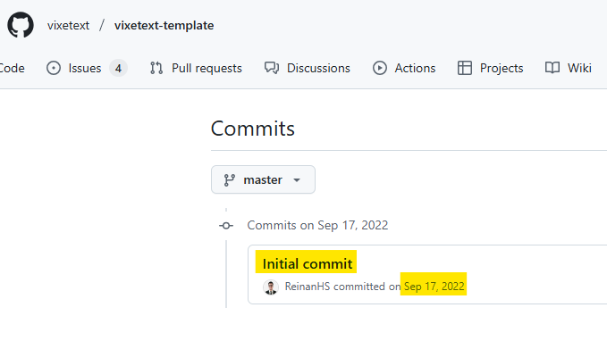

Naquela ocasião, enfrentava recorrentes limitações ao utilizar ferramentas amplamente adotadas, como o **Microsoft Word** e o **Overleaf**. 

---

<!-- _header: Problemas principais identificados naquele período -->

1. **Complexidade** na formatação de trabalhos acadêmicos;
1. **Limitações** nas ferramentas de escrita acadêmica;
1. **Dificuldades** na criação de apresentações acadêmicas;
1. **Falta de integração** entre ferramentas de escrita e apresentação;
1. **Carência** de automatização no processo de elaboração de trabalhos acadêmicos.

---

Esse cenário motivou a busca por uma alternativa que possibilitasse a **escrita acadêmica** por meio do **Markdown**.

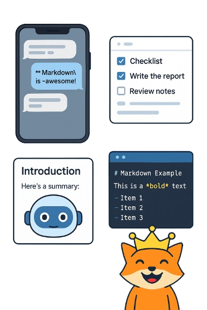

---

<!-- _header: Gráfico comparando a curva de aprendizado entre Markdown e LaTeX -->

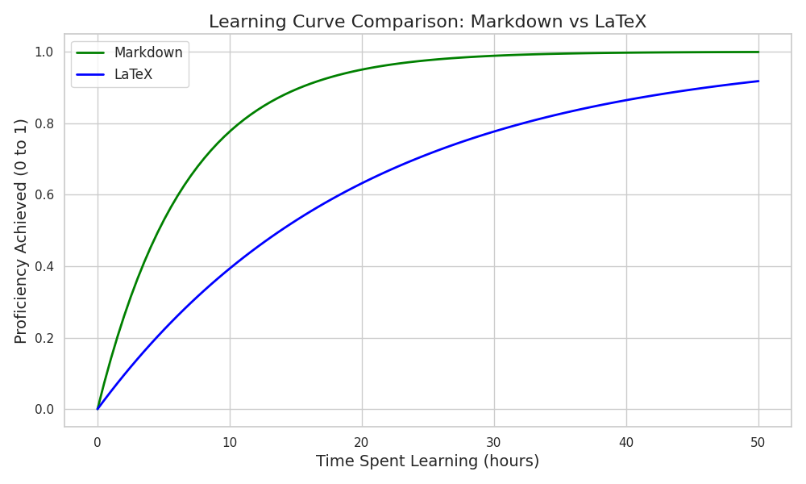

- Markdown: A curva mostra uma ascensão rápida na proficiência com poucas horas de estudo. Isso reflete sua simplicidade e sintaxe intuitiva.

---

<!-- _header: Exemplo de código em LaTeX -->

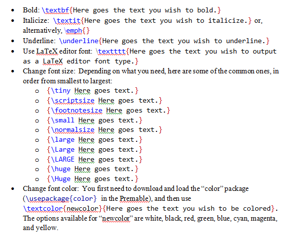

---

<!-- _header: Exemplo de código em Markdown -->

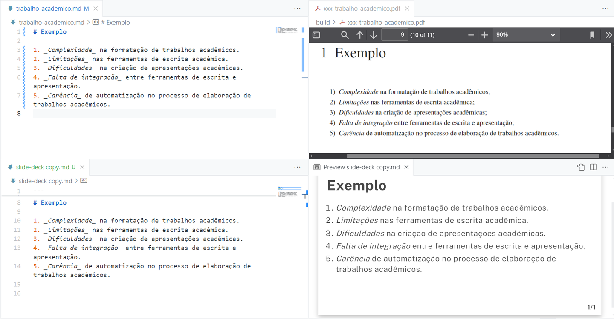

---

<!-- _header: Do conceito à ferramenta -->

A partir dessa motivação, nasceu o **VixeText** 

Ele é uma solução que integra **Markdown**, **Limarka** e **processos automatizados** para simplificar a produção de trabalhos acadêmicos.

O objetivo central foi criar um ambiente **simples**, **padronizado** e **eficiente**, permitindo que estudantes e pesquisadores concentrem-se no conteúdo, sem se preocupar com formatação complexa.

---

<!-- _header: Ilustração da integração -->

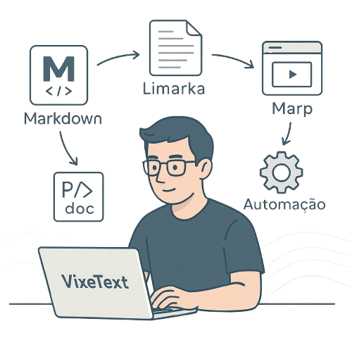

---

<!-- _header: Características principais do VixeText -->

- **Escrita em Markdown**: Sintaxe simples e legível, facilitando a criação de conteúdo.

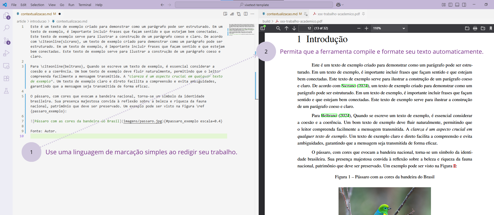

---

<!-- _header: Características principais do VixeText -->

- **Compatibilidade com normas ABNT**: Geração automática de documentos no formato exigido.
- **Gerenciamento de referências**: Uso de BibLaTeX para controle bibliográfico.

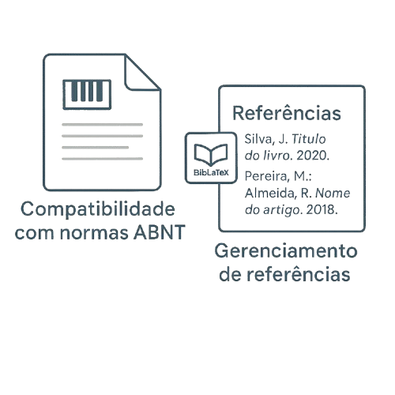

---

<!-- _header: Características principais do VixeText -->

- **Automação com CI/CD**: Compilação e publicação automáticas a partir do repositório.

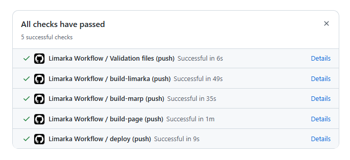

---

<!-- _header: Características principais do VixeText -->

- **Suporte a apresentações**: Integração com Marp para criação de slides acadêmicos.

---

<!-- _header: Benefícios para o usuário -->

O **VixeText** elimina barreiras comuns no processo de escrita acadêmica:

1. **Padronização** de formatação sem esforço manual.
2. **Agilidade** na criação e atualização de documentos.
3. **Integração** de texto, figuras, tabelas e referências de forma automatizada.
4. **Acessibilidade** do conteúdo em diferentes formatos, como PDF e apresentações.

> Com o VixeText, o foco deixa de ser “como formatar” e passa a ser “o que escrever”.

---

<!-- _header: Benefícios para o usuário -->

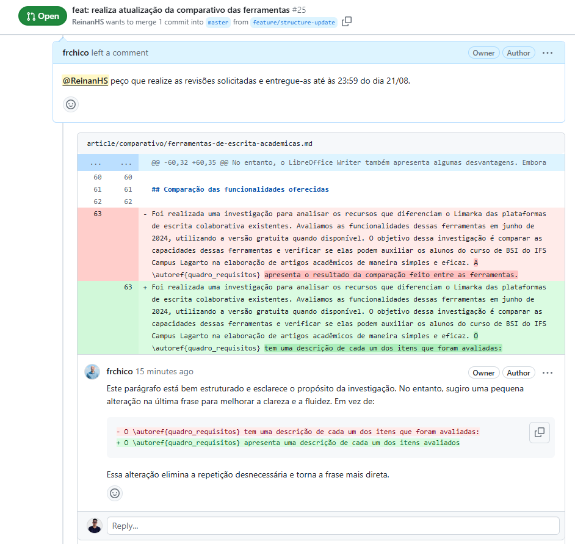

---

<!-- _header: Benefícios para o usuário -->

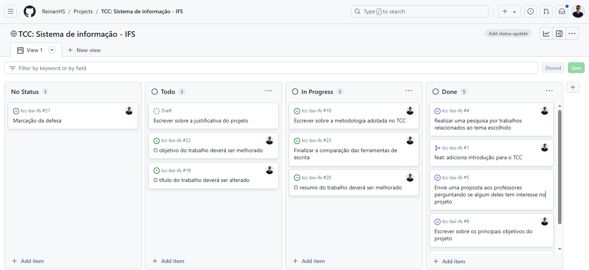

---

<!-- _header: Comparação de ferramentas -->

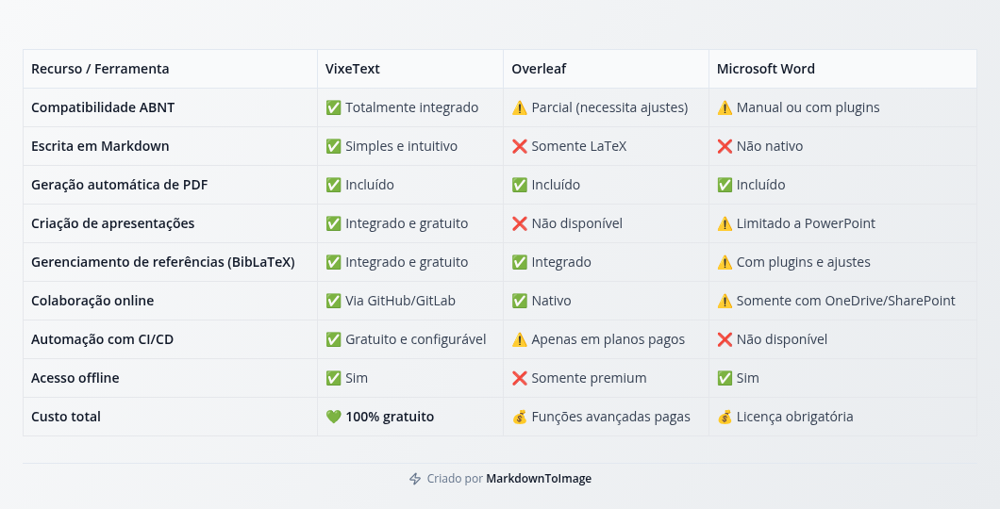
